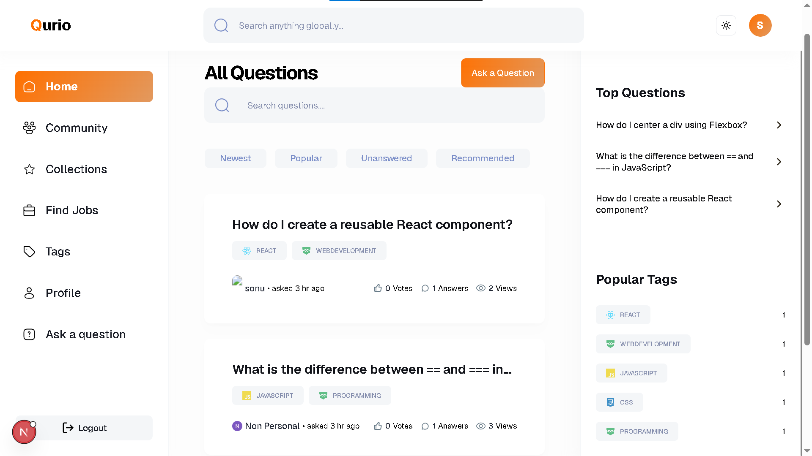
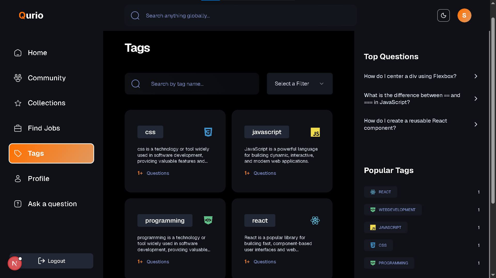

<div align="center">

# Qurio

**A community-driven Q&A platform where developers ask, answer, and grow together.**




Built with Next.js — inspired by Stack Overflow, enhanced with AI-powered answers, gamification, and smart recommendations.

[](https://nextjs.org/)
[](https://www.typescriptlang.org/)
[](https://tailwindcss.com/)
[](https://www.mongodb.com/)
[](https://ui.shadcn.com/)
[](https://ai.google.dev/)

[Live Demo](https://qurio-phi.vercel.app/) · [Report a Bug](https://github.com/RahulSBytes/Qurio/issues/new?labels=bug) · [Request a Feature](https://github.com/RahulSBytes/Qurio/issues/new?labels=enhancement)

</div>

---

## Table of Contents

1. [Introduction](#-introduction)
2. [Tech Stack](#️-tech-stack)
3. [Features](#-features)
4. [Getting Started](#-getting-started)
5. [Environment Variables](#-environment-variables)
6. [Project Structure](#-project-structure)
7. [Acknowledgements](#-acknowledgements)
8. [License](#-license)

---

## Introduction


**Qurio** is a full-stack, production-style Q&A platform built with the latest features of Next.js. It lets developers ask questions, post answers, vote on content, earn reputation through gamification, and get AI-generated answers powered by OpenAI — all wrapped in a clean, responsive UI built with TailwindCSS and ShadCN UI.

The app explores modern Next.js rendering strategies (SSG, ISR, SSR, Server Actions, caching, and revalidation) alongside MongoDB for data persistence and NextAuth (Auth.js) for flexible authentication (Email/Password, GitHub, Google).


---

## Tech Stack

- **Framework:** Next.js (App Router)
- **Language:** TypeScript
- **Styling:** TailwindCSS + ShadCN UI
- **Database:** MongoDB (Mongoose)
- **Authentication:** NextAuth (Auth.js)
- **AI Integration:** Google Gemini API
- **Validation:** Zod
- **Forms:** React Hook Form

---

## 🔋 Features

- **Authentication** — Secure sign-in via Email/Password, Google, and GitHub
- **Home Feed** — Browse questions with search, filters, and pagination
- **Personalized Recommendations** — Suggested questions based on activity
-  **Rich Question Details** — Support for images, code blocks, and formatted content
- **Voting System** — Upvote/downvote questions and answers
-  **View Tracking** — Per-question view counters
- **Bookmarking** — Save questions for later
- **Answer Editor** — MDX-based editor with light/dark mode
- **AI-Generated Answers** — Instant AI assistance for questions
- **Collections** — Manage saved questions with search & filters
- **Community Directory** — Browse and search all users
- **Profiles & Badges** — Track reputation, badges, and engagement history
- **Tags** — Explore questions by tag with dedicated tag pages
- **Ask & Manage** — Create, edit, and delete questions/answers with validation
- **Global Search** — Search across questions, users, and tags
- **Responsive Design** — Optimized for desktop, tablet, and mobile

---

## Getting Started

### Prerequisites

Make sure you have the following installed:

- [Git](https://git-scm.com/)
- [Node.js](https://nodejs.org/en) (v18+ recommended)
- [npm](https://www.npmjs.com/)

### Clone the Repository

```bash
git clone https://github.com/<your-username>/Qurio.git
cd Qurio
```

### Install Dependencies

```bash
npm install
```

### Set Up Environment Variables

Create a `.env` (or `.env.local`) file in the project root — see [Environment Variables](#-environment-variables) below.

### Run the Development Server

```bash
npm run dev
```

Open [http://localhost:3000](http://localhost:3000) in your browser to view the app.

---

## Environment Variables

Create a `.env` file in the root directory and add the following:

```env
# MongoDB
MONGODB_URI=

# Gemini AI
GOOGLE_GENERATIVE_AI_API_KEY=

# Rapid API
NEXT_PUBLIC_RAPID_API_KEY=

# Auth
NEXTAUTH_SECRET=
AUTH_GITHUB_ID=
AUTH_GITHUB_SECRET=
AUTH_GOOGLE_ID=
AUTH_GOOGLE_SECRET=

NEXT_PUBLIC_SERVER_URL=
```

> Replace each placeholder with your own credentials from the respective service dashboards (MongoDB Atlas, OpenAI, Google/GitHub OAuth apps, etc.). Never commit your `.env` file — it's already excluded via `.gitignore`.

---

## Project Structure

```
Qurio/
├── app/            # Next.js App Router pages, layouts & API routes
├── components/     # Reusable UI components
├── constants/       # App-wide constants
├── context/        # React context providers
├── database/       # MongoDB models & connection logic
├── hooks/          # Custom React hooks
├── lib/            # Utility functions, actions & helpers
├── public/         # Static assets
├── types/          # TypeScript type definitions
└── ...config files
```

---

## Acknowledgements

This project was built while learning from [JavaScript Mastery's Next.js course](https://www.jsmastery.pro). The original course project (Devoverflow) can be found [here](https://github.com/JavaScript-Mastery-Pro/devflow). **Qurio** is my own implementation and customization built through that learning process.

---

## License

This project is open source and available under the [MIT License](LICENSE).

---

<div align="center">

Made with ❤️ by [Rahul Sharma](https://github.com/RahulSBytes)

</div>